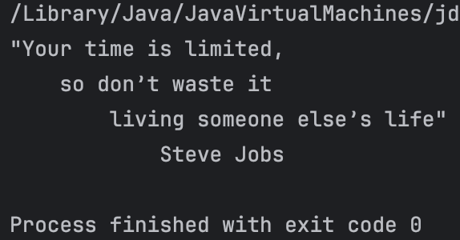

# java_project

## Установленная программа

## Второе дз

## Третье дз

## Четвертое дз

## Пятое дз

## Шестое дз

## Седьмое дз

## Восьмое дз

## Девятое дз

## Десятое дз

## Одиннадцатое дз

## Двенадцатое дз

