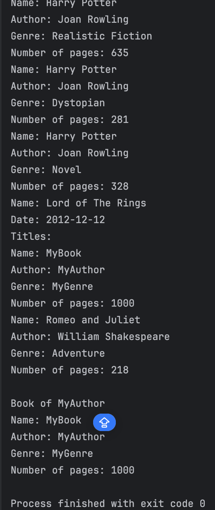
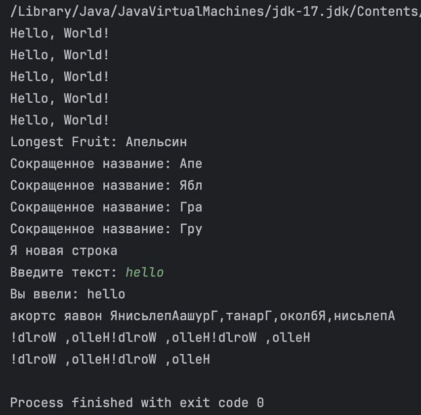
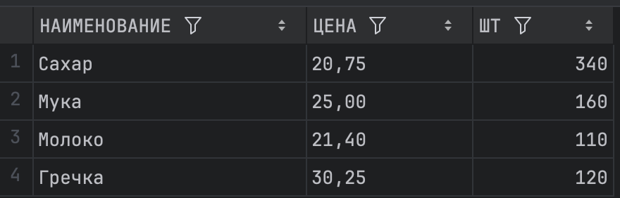
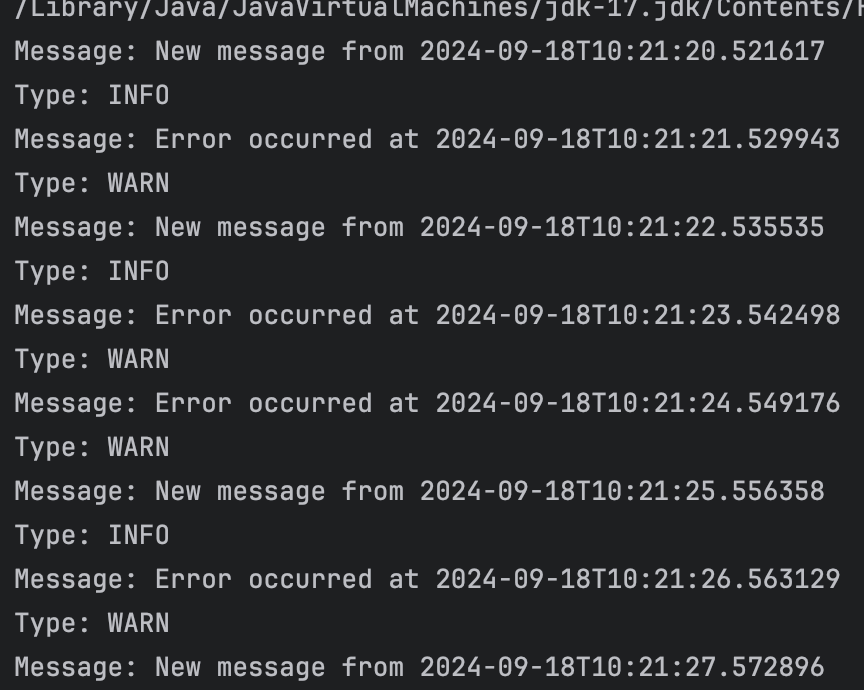
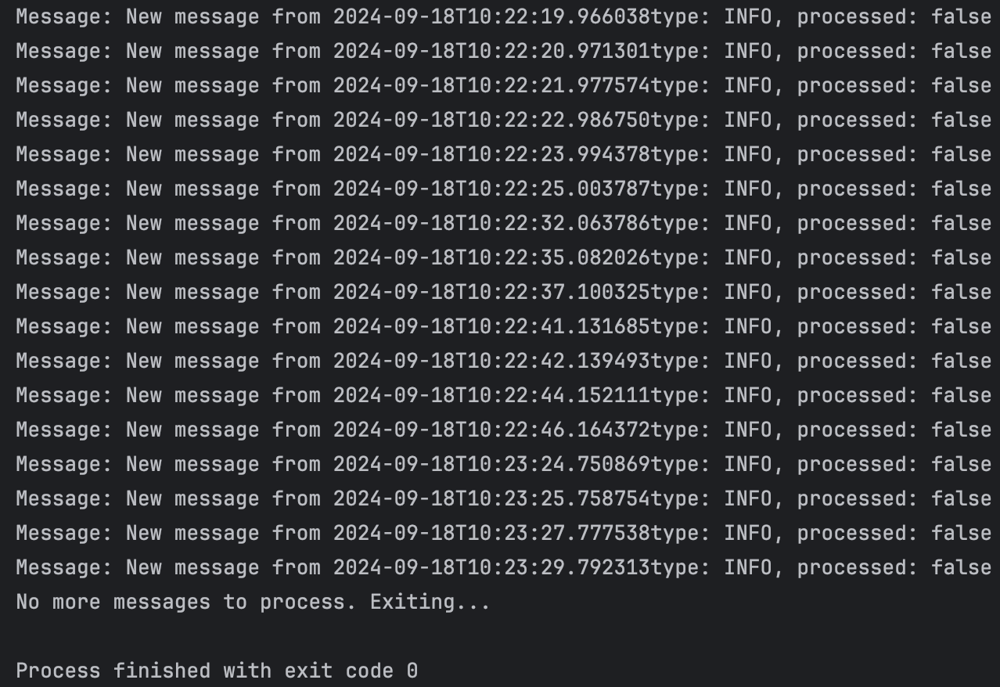

# java_project

## Установленная программа

## Типы данных

## Принципы ООП

## Синтаксис работы с классами

## Абстрактные классы и интерфейсы

## Классы обертки

## Обработка исключений

## Дженерики

## Наследование

## Аннотации

## Стримы

## Потоки ввода-вывода

## Многопоточность

## Maven

## Юнит тестирование.
### Часть 1

### Часть 2

## Начало работы с базами данных в джаве.

## Работа с базой данных через JDBC. Юнит тестирование. Практика.

## Работа с базой данных через JDBC. Юнит тестирование. Практика. Часть 2.

## Введение в Spring

- database: [ссылка](dz19/src/main/resources/createTables.sql)

## Spring Boot

